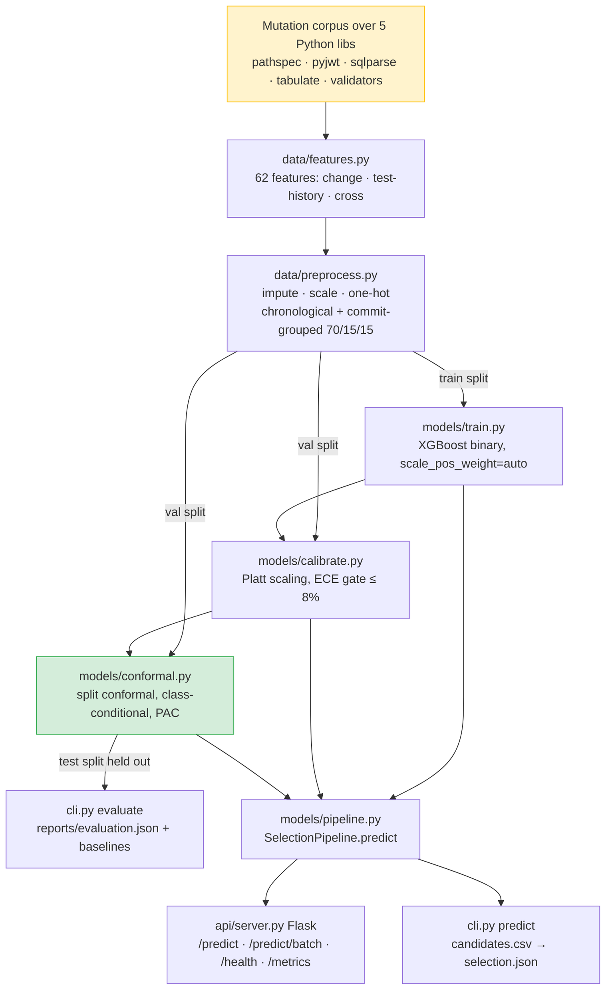

# Architecture Audit — Phase 0

**Project:** CONFIDENCE-CALIBRATED TEST SELECTION WITH CONFORMAL GUARANTEES
*A Multi-Ecosystem Risk-Aware Regression Test Selection Framework for CI/CD (subtitle — see the honesty note in §9 before using "multi-ecosystem")*

**Audit date:** 2026-09-27
**Scope:** read-only inspection of the `conformal-test-selection/` subproject and its
relationship to the surrounding `ConfTest` repository. No code was changed.
**Method:** every number below is read from committed artefacts (`reports/*.json`,
`data/processed/split_summary.json`) or reproduced by running the test suite.
Nothing here is a target or an estimate unless it says so.

> This document does not restate the two existing conformal audits
> (`CONFORMAL_CODE_AUDIT.md`, `CONFORMAL_IMPLEMENTATION_AUDIT.md`); it summarises and
> cross-references them, and covers the architecture-level questions they do not.

---

## Phase 1 status (update — 2026-09-27, after this audit)

Sections §5, §6-Q10 and §10 below record the Phase 0 state. Priority 1 has since
been implemented on top of that state; the audit text is kept as the point-in-time
record, and this addendum is the correction. What now ships:

- **Reason-coded SELECT / ABSTAIN / full-suite decision** — `models/decision.py`
  with a closed set of `reason_codes` (`WITHIN_GUARANTEE`,
  `DEGRADED_FEATURE_COMPLETENESS`, `GUARANTEE_VOIDED_BY_BUDGET`,
  `SELECTION_EXCEEDS_FALLBACK_FRACTION`, `EMPTY_CANDIDATE_SET`). `pipeline.predict`
  now returns a fourth top-level `decision` block *alongside* `predictions` /
  `summary` / `guarantee` (additive, non-breaking). This closes the §6-Q10 /
  §9.4 gap: degraded inputs, a guarantee-voiding cap, an empty set, or a
  near-full selection now produce an explicit `run_full_suite` abstention. Config
  toggles: `selection.abstain_on_degraded`, `abstain_on_voided_guarantee`,
  `full_suite_fallback_rate`.
- **Reproducibility manifest** — `models/manifest.py` + `cli.py manifest` write
  `models/manifest.json` (schema version, git revision, package versions, seed,
  calibration method, and the conformal guarantee/coverage/confidence/threshold/
  `n_calibration`).
- **Evaluation artefacts** — `models/calibrate.py` now writes
  `reports/reliability_diagram.png` (optional, lazy matplotlib — skipped, never
  fatal, when absent) and `reports/calibration_table.csv`. ECE and Brier were
  already in `reports/calibration_report.json`.
- **Versioned normalized test schema + pytest adapter behind a contract** —
  `adapters/` (`schema.py`, `base.py`, `pytest_adapter.py`): a versioned
  `NormalizedTestRecord`, a registry, and framework detection that returns `None`
  (abstain) rather than guessing. The pytest adapter wraps the existing
  `live_extract.discover_tests`, so there is still one definition of "what tests
  exist". **Still Python/pytest-only** — the adapter contract is the seam for a
  second ecosystem, not a second ecosystem (the §7 honesty note stands).

Deliberately **not** started (per the Phase 1 scope): Jest, JUnit 5, dashboard,
Docker, drift monitoring, GitHub Actions. Test suite after Phase 1: **174 passed,
1 skipped**.

---

- `python -m pytest -q` → **144 tests pass** (feature build, preprocessing, training,
  calibration, conformal, serving pipeline, live PR extraction, utilities).
- Trained artefacts are present and loadable: `models/gbdt_model.pkl`,
  `models/calibrator.pkl`, `models/conformal_threshold.pkl`, `models/preprocessor.pkl`.
- The four stage reports (`training_`, `calibration_`, `conformal_report.json`,
  `evaluation.json`) exist and are internally consistent with the artefacts.
- Python 3.11.9. Note the version-skew caveat in §10 (requirements pin
  xgboost 1.7.5 / sklearn 1.3.0; the committed `.pkl`s were produced under newer resolves).

**Verdict:** the core pipeline is implemented, trained, and green. This is an
*extension* audit, not a rebuild.

---

## 1. Current architecture (as built, not as specified)

Green = the novel, verified contribution. Amber = the data-source caveat (§7).

**One-line summary of what exists:** a single-ecosystem (Python/pytest) pipeline that
ranks tests with XGBoost, calibrates the scores with Platt scaling, and converts them
into a **split-conformal selection threshold with a PAC coverage guarantee**, served
over Flask and a CLI. It is real, trained, and tested.

**What the pasted spec assumes but does *not* exist** (detail in §7–§8): multi-ecosystem
adapters (Jest/JUnit/Maven/Gradle), framework detection/registry, a versioned normalized
test schema, an enumerated `reason_code` contract, a first-class SELECT/ABSTAIN/full-suite
decision object *in this pipeline*, a `models/manifest.json`, evaluation image/CSV
artefacts, and a dashboard of its own. Those are greenfield for this subproject.

---

## 2. Data flow and dataset schema

**Source corpus.** 561,711 commit–test rows split chronologically and grouped by
`commit_sha` into 391,825 train / 83,417 val / 86,469 test. Labels are **mutation-kill
outcomes**: a mutant is applied to one of five real Python libraries, the pytest suite
is run, and each test is labelled 1 if it *killed* the mutant (failed) or 0 if it
passed. This is a synthetic-fault corpus, not mined production CI failures and not
real-bug benchmarks (BugsInPy etc.). See the honesty note in §7 — the word "mined" in
the README refers to this mutation corpus.

**Row schema (after `features.py`).** 62 modelled features in three families, plus ID
columns (`test_id`, `test_path`, `changed_file_path`, `commit_sha`, `label`) that
`NON_FEATURE_COLUMNS` excludes from the model:

- **Change features** — repo one-hots, changed-file AST counts, mutation-operator
  signals (the top importances: `mutant_operator_bool_and_to_or`, `cmp_==_to_!=`, …).
- **Test-history features** — `execution_count`, prior modification counts, historical
  fail rates. Built **causally** (only information available *before* the row's commit),
  which is the key leakage control.
- **Cross features** — change↔test relationship: `dep_is_reachable` (top feature,
  importance 0.18), `dependency_distance`, `co_change_frequency`,
  `file_test_similarity`, name-heuristic coupling.

**Preprocessing (`data/preprocess.py`).** Median imputation, scaling, one-hot encoding,
fitted **on the train split only** and frozen; val/test are transformed, never fitted.
The split is temporal and commit-grouped (never random, never repo-held-out — see §10).

---

## 3. Test-selection flow at inference

`raw records → feature frame → preprocessor → XGBoost → calibrator → conformal selector`
(`models/pipeline.py`, called by both `cli.py predict` and `api/server.py`):

1. Build a frame with exactly the modelled columns; absent columns → NaN (imputed).
2. `preprocessor.transform`, then **reindex to the model's training column order**
   (defensive against a refit emitting columns in a new order).
3. `model.predict_proba` → raw P(fail); `calibrator.transform` → calibrated P(fail).
4. `selector.select`: keep a test when `P(fail) ≥ probability_floor` (= `1 − q`).
5. Budget overrides: `min_tests` tops up by descending risk (only *adds* tests, safe);
   `max_tests` can *drop* selected tests, which **voids the guarantee** — the response
   then carries `budget_capped: true` and `guarantee.holds: false`.
6. `feature_completeness` is reported; below `min_feature_completeness` the response is
   flagged `degraded: true` and a warning is logged.

**Important gap (see §5, §6-Q10):** step 6 flags degradation but the pipeline still
returns a SELECT set. There is **no first-class ABSTAIN → run-full-suite decision
state** in this subproject. That state exists only in the *outer* ConfTest project
(`PolicyDecision` with `SAFE_FULL_SUITE`), which uses a different model (LightGBM
ensemble) and is not wired into the conformal guarantee.

---

## 4. Model, calibration, and conformal logic (verified)

**Model (`models/train.py`).** XGBoost `binary:logistic`, `tree_method=hist`,
`max_depth=8`, `lr=0.05`, `n_estimators=500` with early stopping (best_iteration 165),
`scale_pos_weight` resolved to 18.93 (neg/pos ≈ the ~5% failing base rate). Headline
test metrics: **ROC-AUC 0.929, PR-AUC 0.313**. Raw recall at a naive 0.5 cutoff is only
0.159 — which is exactly why a calibrated, conformally-chosen threshold matters, and why
0.5 is a deliberately weak baseline in the evaluation table.

**Calibration (`models/calibrate.py`).** Platt/sigmoid map fitted on the **val** split,
frozen over base-model scores. ECE gate ≤ 8%. Reported: val ECE 1.31% → 0.93%; **test
ECE 0.50% → 0.58%** — i.e. on the held-out test split calibration nudged ECE *up*
slightly (both far under the gate; MCE improved 0.505 → 0.457). Honest reading: the raw
XGBoost scores were already near-calibrated on this corpus; Platt scaling neither helps
nor hurts materially here. It passes the gate and is not doing harm, but it is not the
source of the headline result.

**Conformal (`models/conformal.py`).** Split conformal, **class-conditional (Mondrian)
over the failing class**. Nonconformity `s = 1 − p_calibrated`. Two rank rules:
`marginal_rank = ceil((n+1)(1−α))`, and `pac_rank` = smallest k with
`Beta.ppf(δ, k, n+1−k) ≥ 1−α` (Vovk-2012 training-conditional bound, binary-searched).
Configured guarantee = **PAC** at coverage 0.95, confidence 0.90. Fitted on 4,578 val
failing rows → rank 4369, `probability_floor = 0.0381`, **certified coverage 0.9501**.

**Held-out test results (`reports/evaluation.json`, 86,469 rows / 3,208 failures):**

| Metric | Target | Measured |
|---|---|---|
| Recall (failing tests caught) | ≥ 0.92 | **0.9523** |
| Selection rate | ≤ 0.40 | **0.2525** |
| ECE | ≤ 0.08 | **0.0058** |
| Conformal coverage | ≥ 0.95 | **0.9523** |
| Cost reduction | ≥ 0.60 | **0.7475** |

Per-commit (not guaranteed, reported honestly): **65.2%** of failing commits *fully*
caught, **95.6%** caught at-least-one. `cost_matched_topk` reproduces the conformal
numbers exactly — confirming conformal's contribution is choosing *how many* tests to
run without peeking at labels, not being a better ranker.

---

## 5. Verified vs. heuristic/absent claims

**Verified (implemented, tested, reproducible):**
- Valid split conformal, class-conditional, with a genuinely-implemented PAC rank
  (inverse-Beta), independently re-derived in `CONFORMAL_CODE_AUDIT.md`.
- 95.2% coverage / 25.3% selection / 74.7% cost reduction on the held-out test split.
- Leakage controls: causal history features, commit-grouped chronological split,
  preprocessor fitted on train only, threshold fitted on val not test.
- ECE ≤ 8% gate; XGBoost with imbalance handling; Flask `/predict`, `/predict/batch`,
  `/health`, `/metrics`; budget-cap voids the guarantee and says so.

**Absent relative to the pasted spec (must NOT be claimed until built + tested):**
- Multi-ecosystem support. **Python/pytest only.** No Jest/JUnit/Maven/Gradle, no
  framework detection/registry, no adapter interface (even pytest is handled inline in
  `live_extract`, not behind an adapter contract).
- Versioned normalized test schema doc; enumerated `reason_code` contract.
- First-class SELECT/ABSTAIN/full-suite decision object in this pipeline (only a
  `degraded` boolean + `holds:false` on cap exist).
- `models/manifest.json` (single versioned manifest with lib versions, git hash, schema
  version). Today there are per-stage report JSONs only.
- Evaluation artefacts as images/CSV (`reliability_diagram.png`, `calibration_table.csv`,
  per-framework metrics). Metrics live in `reports/*.json`.
- A dashboard, SHAP explainability, drift monitoring, and Docker *for this subproject*
  (some exist in the outer ConfTest project against a different model).
- Isotonic calibration is a code path but Platt is what ships.

---

## 6. Answers to the ten conformal-correctness questions

1. **Training separate from calibration fitting?** Yes — model on train, Platt on val,
   distinct artefacts.
2. **Calibration separate from final evaluation?** Yes for evaluation (test is untouched),
   but **calibrator and conformal threshold share the val split**. Defensible (a 2-param
   sigmoid adds negligible optimism) and documented, but worth stating plainly.
3. **Nonconformity scores properly defined?** Yes — `s = 1 − p_calibrated`, class-conditional.
4. **Thresholds fitted only on held-out calibration data?** Yes — on val, never test;
   asserted by tests.
5. **Inference uses the same preprocessing/features?** Yes — one shared `SelectionPipeline`,
   with a defensive reindex to training column order.
6. **Coverage/risk objective written down?** Yes — recall over the failing class, marginal
   over failing tests; stated in code, README, and `guarantee_statement`.
7. **Exchangeability + assumptions documented?** Yes — extensively, including the temporal/
   cross-project caveat.
8. **PAC actually implemented, or only claimed?** Implemented — inverse-Beta rank, certified
   coverage computed and reported.
9. **Does a max-test budget invalidate coverage?** Handled — `max_tests` sets
   `budget_capped:true` / `holds:false`; `min_tests` only adds tests; both-ways metrics reported.
10. **Safe abstention implemented correctly?** **Partially — the weakest point.** Degraded
    inputs are flagged and a dropped-cap voids the guarantee, but the pipeline never emits a
    reason-coded ABSTAIN → run-full-suite decision. Section G's mandatory abstention
    conditions are not implemented here. This is the top candidate for the first change.

---

## 7. Framework / language support (honesty note)

The system supports **one ecosystem: Python + pytest.** The subtitle's phrase
"Multi-Ecosystem" describes an *intended* direction, not the current build. Until
adapters for a second framework exist and pass tests against real fixtures, the audit,
README, and any report must say "Python/pytest" and reserve "multi-ecosystem" for a
roadmap section. Likewise, the corpus is a **mutation-fault** corpus over five Python
libraries — describe it as such, not as mined production failures.

## 8. Two-project structure (a real risk, not a nitpick)

The repository contains two overlapping systems:

- **Inner `conformal-test-selection/`** (this audit): XGBoost + Platt + split conformal,
  the verified PAC contribution. No abstain state, single ecosystem.
- **Outer `ConfTest`**: a 5-seed LightGBM ensemble with a `PolicyDecision`
  (SELECT / SAFE_FULL_SUITE) abstain policy, a dashboard, and broader (out-of-scope)
  features. It has abstention but **no conformal guarantee**, and is connected to the
  inner project only through the advisory CI job.

The spec's ideal — conformal guarantee *and* reason-coded abstention *and* multi-ecosystem
in one place — exists in neither project today. Before extending, decide the **target
home** so we enhance one pipeline rather than fork a third. Recommendation: build on the
inner conformal pipeline (it owns the guarantee) and port the abstain concept into it,
rather than the reverse.

## 9. Risks before extending

1. **Divergent models/projects** (§8) — fragmentation risk.
2. **Version skew** — requirements pin xgboost 1.7.5 / sklearn 1.3.0, artefacts were
   produced under newer resolves; retraining under the pins may shift numbers.
3. **External validity** — synthetic mutation corpus, 5 Python libs, not repo-held-out;
   cross-project exchangeability is untested, so realized coverage must be monitored.
4. **No abstain state** — Section G compliance needs a new decision layer.
5. **Multi-ecosystem is fully greenfield** — large; must stay a roadmap item until tested.
6. **Do not clobber** trained artefacts or the 144 passing tests.

## 10. Recommended upgrade order (small, backward-compatible)

- **P1.a — Reason-coded SELECT/ABSTAIN/full-suite decision** in `pipeline.py` (Section G).
  Highest value, self-contained, closes the weakest honest gap. Add a `decision` +
  `reason_codes` block *alongside* existing `predictions`/`summary`/`guarantee` (no
  breaking change).
- **P1.b — `models/manifest.json`**: versioned, with lib versions, git hash, schema
  version, threshold, calibration method (Section D).
- **P1.c — Evaluation artefacts**: `reliability_diagram.png`, `calibration_table.csv`,
  `calibration_metrics.json` under `artifacts/evaluation/` (data already computed).
- **P1.d — Versioned normalized test schema doc + validator** for the single pytest
  ecosystem, as the foundation for later adapters (Section H.2).
- **P2 — Adapter interface + registry**, pytest as the first real adapter (refactor
  `live_extract` behind it), then Jest, then JUnit — each gated by tests + fixtures.
- **P3 — Dashboard for this subproject, SHAP, drift monitoring, Docker.**

Each item is independently shippable and leaves the green test suite green. Nothing above
is started until Phase 0 is approved.

